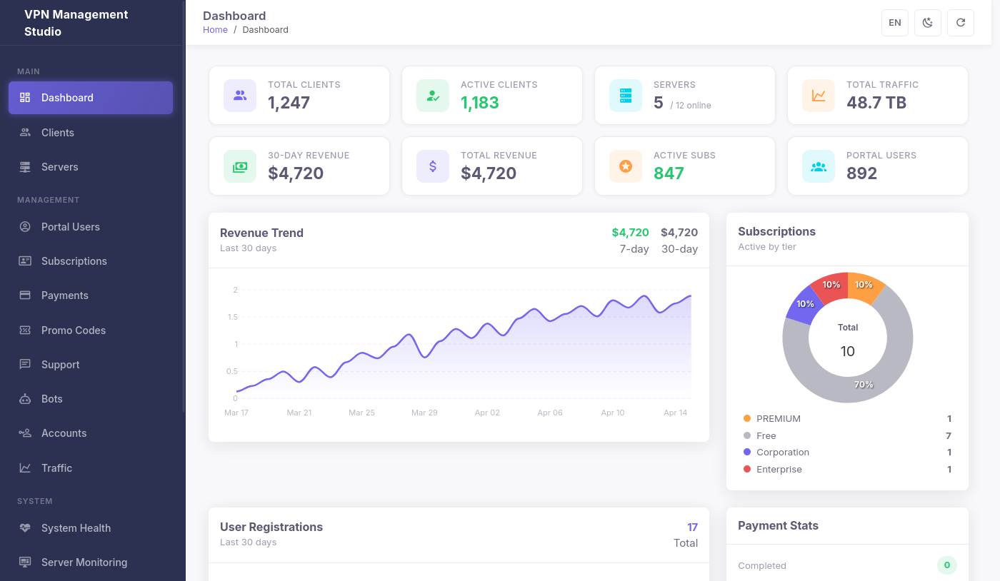
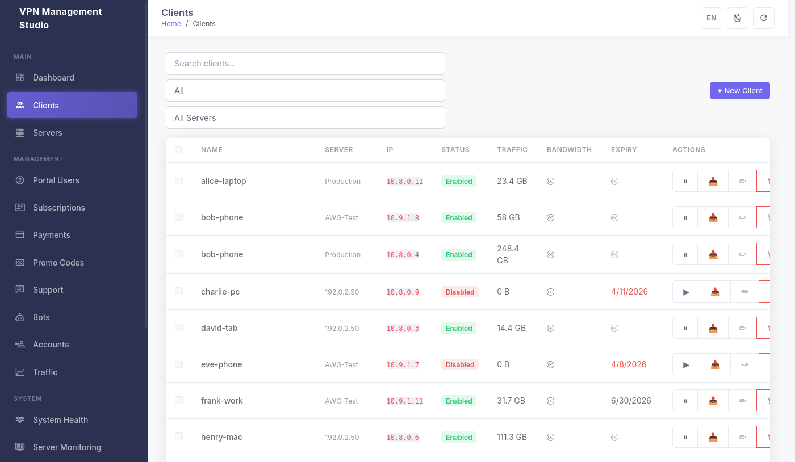
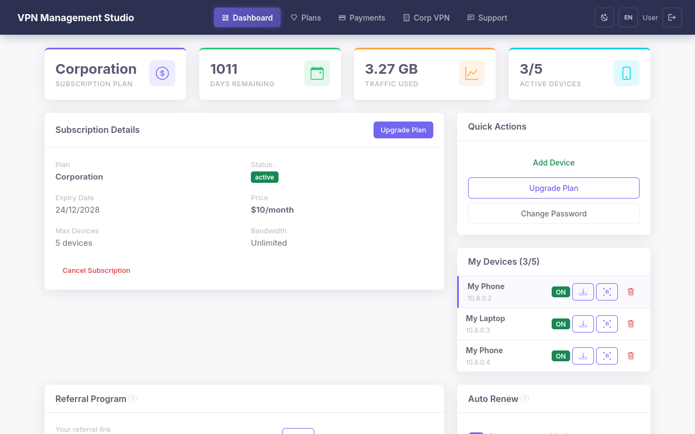
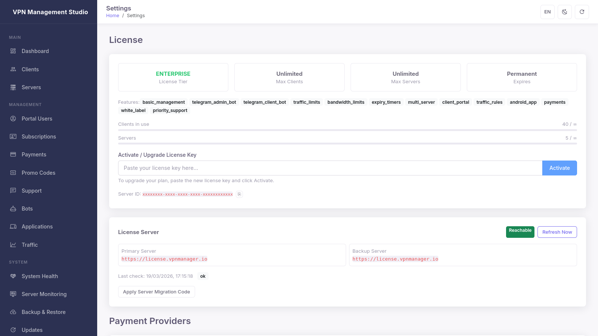

<p align="center">
  
  
  
  
  
</p>

# VPN Management Studio

**Self-hosted multi-protocol VPN management platform.** Deploy, manage, and monetize your own VPN infrastructure with WireGuard, AmneziaWG, Hysteria2, and TUIC. Admin panel, client portal, Telegram bots, crypto payments — everything in a single install.

<p align="center">
  <a href="https://flirexa.biz">Website</a> ·
  <a href="https://flirexa.biz/#pricing">Pricing</a> ·
  <a href="mailto:support@flirexa.biz">Support</a>
</p>

---

## Screenshots

<p align="center">
  
</p>
<p align="center"><em>Dashboard — real-time KPIs, revenue trend, subscription analytics</em></p>

<details>
<summary><strong>More screenshots</strong></summary>

<p align="center">
  
</p>
<p align="center"><em>Client Management — online indicators, traffic, bandwidth limits, QR codes</em></p>

<p align="center">
  
</p>
<p align="center"><em>Multi-Server — manage servers across regions from one panel</em></p>

<p align="center">
  
</p>
<p align="center"><em>Client Portal — self-service registration, config download, subscription management</em></p>

<p align="center">
  
</p>
<p align="center"><em>Telegram Bots — admin management and client self-service via mobile</em></p>

<p align="center">
  
</p>
<p align="center"><em>Settings — white-label branding, system config, all localized</em></p>

</details>

---

## Key Features

### VPN Protocols
- **WireGuard** — fast, modern, industry standard
- **AmneziaWG** — censorship-resistant WireGuard fork
- **Hysteria2** — QUIC-based proxy, bypasses DPI
- **TUIC** — UDP relay, low latency

### Admin Panel
- Dashboard with KPIs, revenue charts, subscription analytics
- Client CRUD with QR codes, config export, traffic/bandwidth limits
- Multi-server management across regions via SSH
- Server health checks, monitoring, diagnostics
- Promo codes, referral tracking, revenue analytics
- System health, backup/restore, update/rollback
- Fully localized in 6 languages (EN, RU, UK, DE, FR, ES)

### Client Portal
- Self-service registration and authentication
- Subscription plans with crypto payments
- VPN config download and QR codes
- Traffic stats and support tickets

### Telegram Bots
- **Admin Bot** — create clients, check stats, receive alerts
- **Client Bot** — register, get config, check balance, pay via CryptoPay

### Commercial Toolkit
- Subscription management with flexible plans
- Crypto payments (BTC, ETH, USDT, USDC, LTC, XMR, TON, SOL)
- Automated license delivery after purchase
- White-label branding — name, logo, colors from admin panel
- Corporate VPN with site-to-site tunnels

---

## Pricing

| | Starter | Business | Enterprise |
|---|:---:|:---:|:---:|
| **Price** | **$99** | **$249** | **$499** |
| Clients | 50 | 200 | Unlimited |
| Servers | 1 | 5 | Unlimited |
| Admin Panel | ✅ | ✅ | ✅ |
| Telegram Admin Bot | ✅ | ✅ | ✅ |
| Client Telegram Bot | — | ✅ | ✅ |
| Client Portal | — | ✅ | ✅ |
| Multi-Server | — | ✅ | ✅ |
| Traffic Rules | — | ✅ | ✅ |
| White-Label | — | — | ✅ |
| Corporate VPN | — | — | ✅ |
| Priority Support | — | — | ✅ |

One-time purchase. No recurring fees. Updates included while product is maintained.

<p align="center">
  <a href="https://flirexa.biz/#pricing"><strong>Buy Now →</strong></a>
</p>

---

## Quick Start

```bash
tar xzf vpn-manager-v1.4.48.tar.gz
cd vpn-manager-v1.4.48
sudo bash install.sh
```

Open `http://YOUR_SERVER_IP:10086` after install.

### System Requirements

| | Minimum | Recommended |
|---|---|---|
| OS | Ubuntu 20.04+ / Debian 11+ | Ubuntu 22.04 LTS |
| CPU | 1 core | 2+ cores |
| RAM | 1 GB | 2+ GB |
| Disk | 10 GB | 20+ GB SSD |
| Network | Public IPv4 | Public IPv4 + domain |

---

## Documentation

| Document | Description |
|----------|-------------|
| [Getting Started](getting-started.md) | Overview, quick start, feature summary |
| [Installation](installation.md) | System requirements, install script, SSL |
| [Pricing & Plans](pricing.md) | Tier comparison, features, payment info |
| [Licensing](licensing.md) | Activation, hardware binding, transfers |
| [Adding Servers](add-server.md) | Connect remote servers via SSH |
| [Client Management](client-management.md) | Creating clients, QR codes, traffic limits |
| [CLI Reference](cli-reference.md) | `vpnmanager` commands and usage |
| [Backup & Restore](backup-restore.md) | Scheduled backups, restore procedure |
| [Updates](updates.md) | Update mechanism, rollback |
| [Troubleshooting](troubleshooting.md) | Common issues and fixes |
| [Architecture](architecture.md) | System architecture overview |
| [API Reference](api.md) | REST API endpoints |
| [Support](support.md) | Contact, SLA, diagnostics |
| [Changelog](CHANGELOG.md) | Version history |

---

## Support

- **Email:** [support@flirexa.biz](mailto:support@flirexa.biz)
- **Website:** [flirexa.biz](https://flirexa.biz) (live chat in bottom-right corner)
- **Response time:** within 24 hours

---

## Open Source Credits

VPN Management Studio uses the following open-source components:

- [WireGuard](https://www.wireguard.com/) — Jason A. Donenfeld (GPLv2)
- [AmneziaWG](https://github.com/amnezia-vpn/amneziawg-go) — Amnezia VPN project (MIT)
- [Hysteria](https://github.com/apernet/hysteria) — Toby (MIT)
- [TUIC](https://github.com/EAimTY/tuic) — EAimTY (GPLv3)

---

<p align="center">
  <a href="https://flirexa.biz"><strong>flirexa.biz</strong></a> · © 2026 VPN Management Studio
</p>
